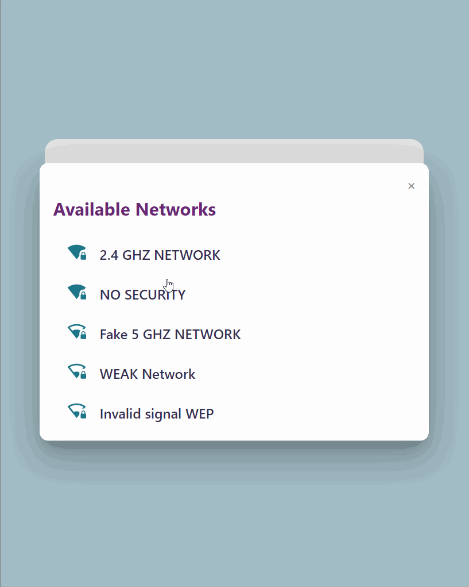

# Captive Portal WiFi Manager

A custom Captive Portal WiFi Manager for ESP8266 (with automatic C header file generation with gzip compression, modern interface, and PlatformIO support)



## **WARNING: This is a work in progress!**

## Key features

### Firmware
- Save credentials and IP Settings to EEPROM
- Automatic Captive Portal (no need to type the device IP address)

### Web Page
- Modern UI
- Vanilla JS and CSS (No frameworks like bootstrap or jQuery)
- Compatible with most recent browsers.
- Designed with accessibility in mind (ARIA tags)
- Single page design with all assets inline (prevent multiple HTTP requests to ESP which in my opinion supplants the disadvantage of not make use of the browser cached assets).
- Fake Web Server to test and customize the device response without need an IOT device.
- Automated build task. The included gulp script does the following:
  - optimize the images compression
  - inline all the styles, scripts and images assets
  - minify the webpage
  - compress to gzip
  - convert to C byte array and save a C header file


## Compatibility
- ESP8266 only (I don't have an ESP32)
- PlatformIO

## Config flowchart


## Alternatives (Better and more mature)
- WiFi Manager: https://github.com/tzapu/WiFiManager
- AutoConnect for ESP8266/ESP32: https://github.com/Hieromon/AutoConnect
- JustWifi: https://github.com/xoseperez/justwifi


### About the dialog ("modal popup")
My first approach was to use the native HTML5 `dialog` tag (https://developer.mozilla.org/en-US/docs/Web/HTML/Element/dialog) but this feature isn't yet supported by Safari. I've could use the dialog polyfill (https://github.com/GoogleChrome/dialog-polyfill) but that will at least double the bundle size. So my solution was to create a custom dialog with the good old `div` tag and some code.
With my solution, you can create multiple dialogs without writing an individual code to trigger each one. The JS code scans for all dialogs and buttons on the page load and adds the event listeners to open/close them.

**Dialog Structure (minimal code)**
```
<button data-dialog_open="dialog-info">Open Dialog</button>

<div tabindex="-1" role="dialog" aria-hidden="true" id="dialog-info" class="dialog-container">
    <!-- Optional Close button -->
    <button data-dialog_close="dialog-info">&times;</button>
    <div>
    <!-- Content goes here -->
    </div>
</div>
```

### 

## Credits
Radio button CSS style from: https://github.com/finnhvman/matter 

